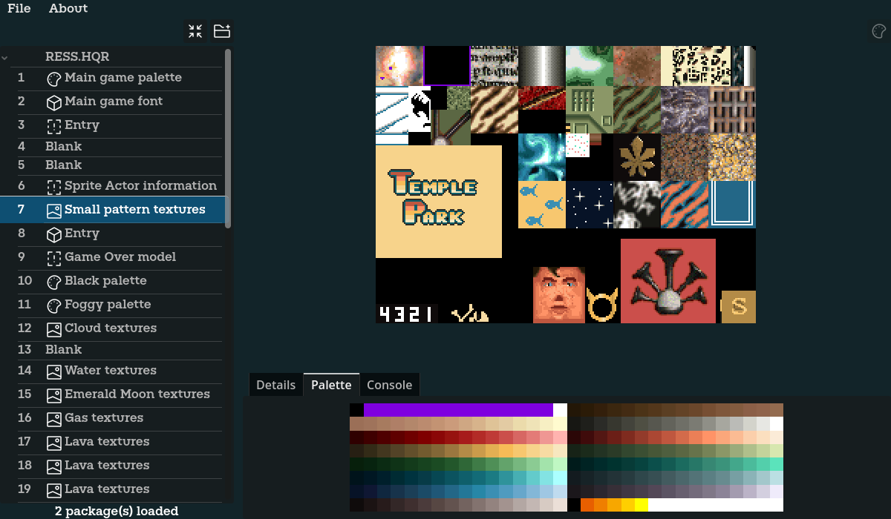
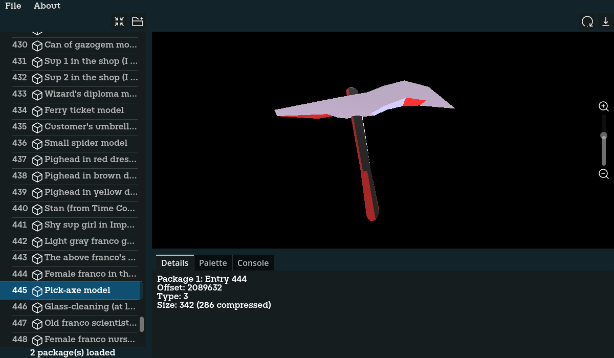

# LBAExplorer

**LBAExplorer** is a tool for browsing game package files from *Little Big Adventure 1 & 2* (classic editions).

⚠️ This software is provided as-is, without data. You need to legally own the games in order use this tool.

---

## Features

📦 **Opens LBA1 & LBA2 archive formats**:
 All extensions share the same file type, only the content differs
  - `.HQR` Main game archives containing multiple resources
  - `.ILE` Level and scene data       
  - `.OBL` 3D models and animations

👁️ **Built-in viewers**:
  - **2D Viewer**: for sprites and images.
    - Support for palette mapping from any source
    - Export any texture to png
  - **3D Viewer**: for models and animations.
    - Export any model to glb/gltf
    - 🚧LBA1 models are not supported yet
    - 🚧Animations are not supported yet
    - 🚧Texture mapping is not supported yet
    - 🚧Skeleton rigging is not supported yet
  - **Hex Viewer**: for raw data, text files, or unknown content.
    - Export any data to an external file

## Compatibility

- Supports *Little Big Adventure 1 & 2* (original DOS/Windows versions).
- Not compatible with 2.21 remastered editions.

## Installation

1. Clone or download the project.
2. Run the executable (`LBAExplorer.exe`), or open the project in [Godot](https://godotengine.org) if you're working with the source.

## Special thanks

This software widely uses the work of many projects from https://github.com/LBALab and the work of many people from the discord community.
Big thanks to all of them, especially members of the Magicball network, who have made the reverse engineering of the game possible.

## Disclaimer

This is a fan-made tool and is not affiliated with Adeline Software or the current rights holders of *Little Big Adventure*. All trademarks and content belong to their respective owners.
